# Configuraciones Personales

## [Windows Terminal](https://www.microsoft.com/en-us/p/windows-terminal/9n0dx20hk701?activetab=pivot:overviewtab)
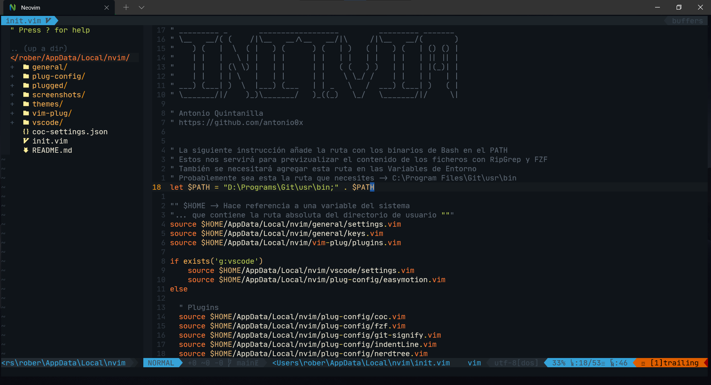

## [Visual Studio Code](https://code.visualstudio.com/download)
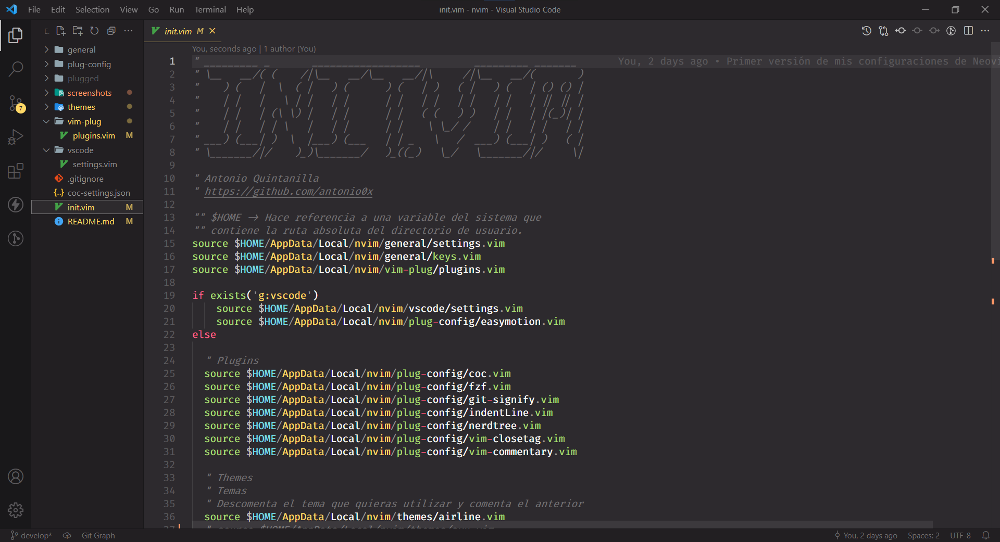

> **Nota**: Si solamente deseas personalizar la Windows Terminal te compartó el enlace directo a dicha sección (*Instalar la PowerShell Core es **requerido***):
# Enlaces directos

### [Instalar la PowerShell Core 7](#powershell-core-7)
### [Personalizar la Terminal](#personalizar-el-prompt-de-powershell)

-----

# Índice

- [Información General](#información-general)
- [Requerimientos](#requerimientos)
  - [Windows Terminal](#windows-terminal-1)
  - [PowerShell Core 7](#powershell-core-7)
  - [Chocolatey](#chocolatey)
- [Neovim](#neovim)
  - [Dependecias](#dependecias)
  - [Instalación de Neovim](#instalación-de-neovim)
  - [Instalar manejador de Plugins](#instalar-manejador-de-plugins)
    - [Recomendaciones](#recomendaciones)
- [Extra](#extra)
  - [Personalizar el prompt de PowerShell](#personalizar-el-prompt-de-powershell)
    - [Instalar una fuente compatible](#instalar-una-fuente-compatible)
    - [Instalación de Oh My Posh](#instalación-de-oh-my-posh)
  - [Agregar Perfil de PowerShell Core](#agregar-perfil-de-powershell-core)

# Información General

Esta guía ha sido realizada con el propósito de crear una solución a la instalación y configuración un poco tediosa de Neovim en el Sistema Operativo Windows 10.
Con está guía podrás obtener una configuración decente de Neovim en Windows 10 y poder incrementar tu productividad a la hora de escribir código.

# Requerimientos
Para realizar la instalación de Neovim primero debemos contar con las siguientes herramientas o utilidades en nuestro sistema, es **importante no saltarse ningún paso**.

## Windows Terminal

Para poder utilizar Neovim y toda su potencia necesitamos un emulador de terminal más bonito que el clásico y viejo CMD o la PowerShell de Windows, así que vamos a hacer a instalar la Windows Terminal.

Accedemos a la [Microsoft Store](https://www.microsoft.com/en-us/store/apps/windows) y en la barra de búsqueda escribimos: Windows Terminal Preview. Seleccionamos la Windows Terminal Preview.

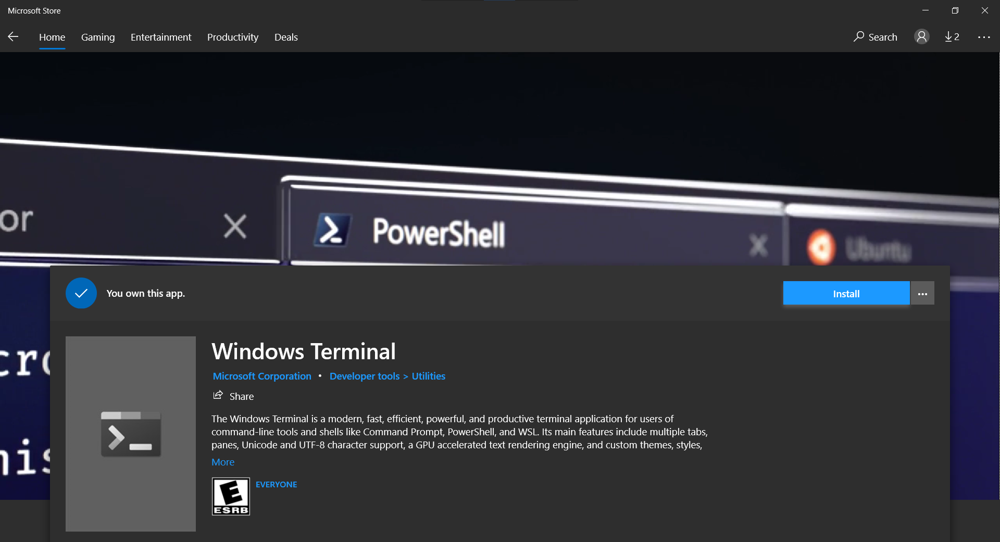

Para personalizar la Terminal puedes usar los atajos de teclado ```Ctrl + ,```. 

Puedes agregar una imagen de fondo, cambiar tamaño y el tipo de fuente, etc.
Más adelente vamos a personalizar la PowerShell Core.

## PowerShell Core 7

Ahora necesitamos una Shell más moderno y que se adapte a nuestras necesidades, así que vamos a instalar la [PowerShell Core](https://github.com/PowerShell/PowerShell).

Para instalarla necesitaremos visitar la página de los Releases estables: [PowerShell Core](https://github.com/PowerShell/PowerShell/releases/tag/v7.1.3) y vamos a elegir el Instalador de Microsoft para la arquitectura de x64 bits.


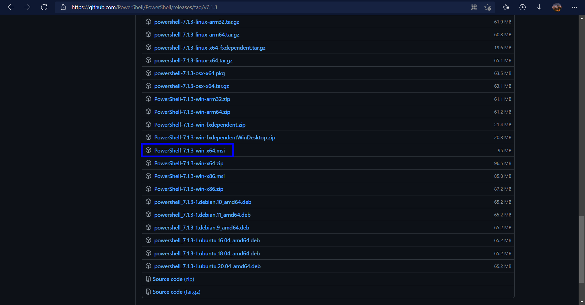

Una vez descargado sólo necesitaremos ejecutar el Instalador y dar los clásicos clicks de siguiente, siguiente y finalizar.


## Chocolatey

En este caso íremos directo a la instalación de Chocolatey pero aquí puedes encontrar la [Guía Oficial](https://chocolatey.org/install) de Instalación del gestor de paquetes para Windows llamado [Chocolatey](https://chocolatey.org/).

Para realizar la instalación de Chocolatey necesitamos abrir una ventana de la [PowerShell Core 7](https://es.wikipedia.org/wiki/PowerShell) que instalamos previamente y **con permisos de Administrador**.

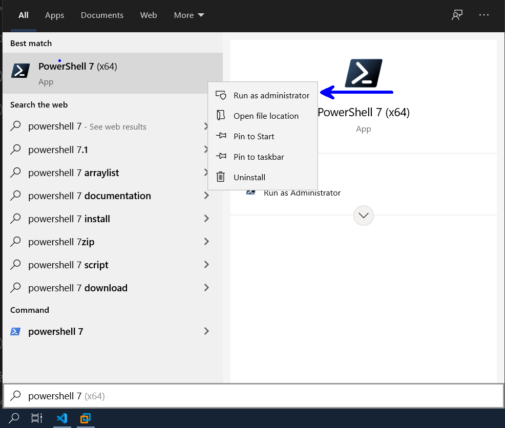


Luego vamos a ejecutar la siguiente instrucción:

```powershell
Set-ExecutionPolicy Bypass -Scope Process
```

Posteriormente necesitamos ejecutar la siguiente instrucción o **comando** para descargar el script de instalación:

```powershell
Set-ExecutionPolicy Bypass -Scope Process -Force; [System.Net.ServicePointManager]::SecurityProtocol = [System.Net.ServicePointManager]::SecurityProtocol -bor 3072; iex ((New-Object System.Net.WebClient).DownloadString('https://chocolatey.org/install.ps1'))
```

***Para limpiar la Terminal podemos usar la combinación de teclas ```Ctrl + L```, o también podemos escribir ```cls``` o ```clear```***.

> Una vez realizado el paso anterior y que no hayan existido errores  puedes probar a escribir ```choco o choco -?``` para verificar que el programa existe. *No cerrar la Ventana de la PowerShell para el siguiente paso*.

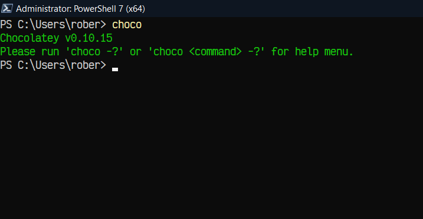

# [Neovim](https://neovim.io)

## Dependecias

Una vez hayamos finalizado con la instalación de **chocolatey** haremos la instalación de las depencias necesarias para Neovim. 

- RipGrep
- NodeJS
- Git 

> *Si ya tienes **Git** y **NodeJS** instalado puedes omitir la opción borrando la palabra **git** u omite la primera instrucción y utiliza la segunda.*


```powershell
choco install ripgrep nodejs git -y
```

```powershell
choco install ripgrep -y
```

> La flag o bandera **-y** permite ejecutar la instalación sin pregutar por confirmaciones, tal cual como lo hace **apt install -y** en Debian.


Una parte importante para no tener problemas con RipGrep y obtener un filtrado del contenido de los archivos con FZF vamos a necesitar obtener la ruta de los comandos básicos en un shell de Linux y esto lo vamos a conseguir con Git **sin necesitad de utilizar WSL**.

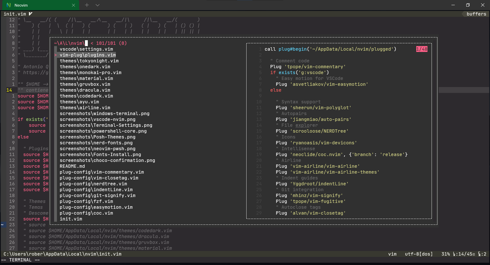

**Importante:** Sí acabas de instalar **Git** y **Node JS** es necesario que los añadas en el **PATH**, yo me encargué de hacerlo de manera permanente, es decir, no tendrás que ir directamente a añadir la ruta de manera manual.


El siguiente comando es una pequeño Script de automazación que yo he hecho para agregar la ruta de los binarios básicos de un sistema Linux tradicional, también la ruta del ejecutable de NodeJS, Neovim y Git de manera permanente, para que funcioné se **necesitará abrir la Windows Terminal o PowerShell Core con permisos de administrador**.

> Ojo, esto funcionará si has hecho la instalación por defecto de Git y Node JS, es decir, que no hayas cambiado la ruta donde ha sido instalado.

Vamos a agregar las rutas al Path de las Variables del Sistema, solamente pega lo siguiente en **Modo Administrador**:

```powershell
$env:Path += ";C:\Program Files\Git\cmd"; $ACTUAL_PATH = (Get-ItemProperty -Path 'Registry::HKEY_LOCAL_MACHINE\System\CurrentControlSet\Control\Session Manager\Environment' -Name path).path;`
$GIT_USR_PATH = (cmd /c where git); $GIT_USR_PATH -replace "\\cmd\\git.exe", "\usr\bin" | Tee-Object -Variable GIT_USR_PATH; $NEW_PATH = "$ACTUAL_PATH;$GIT_USR_PATH;C:\Program Files\Git\cmd;C:\Program Files\nodejs;C:\tools\neovim\Neovim\bin"; Set-ItemProperty -Path 'Registry::HKEY_LOCAL_MACHINE\System\CurrentControlSet\Control\Session Manager\Environment' -Name path -Value $NEW_PATH
```
Una vez pegado es cuestión de darle **Enter** para ejecutar la instrucción.

> **Descripción:** Lo primero que hace el script es agregar de manera temporal **Git** en las variables de entorno, luego hace la búsqueda del Path de las variables del sistema y las guarda en una variable. Luego creo una variable para guardar la ubicación del *usr\\bin* de Git. Finalmente en una variable nueva guardo las rutas que agregaré y finalmente las guarda de forma permanente en las Variables del Sistema (*hice muchas pruebas en mi máquina y en máquinas virtuales para asegurarme de que todo funcione correctamente*).

## Instalación de Neovim
Para la instalación vamos a utilizar **permisos de administrador** en una PowerShell Core o nuestra Windows Terminal y pegar la siguiente instrucción de instalación con chocolatey:

```powershell
choco install neovim -y --pre
```

> La flag *--pre* le índica a chocolatey que vamos a instalar una versión de un programa en su fase beta, es decir, un pre-release de una aplicación, en este caso [**Neovim**](https://neovim.io) en su versión 0.5.0.

## Instalar manejador de Plugins
Una vez instalado vamos a necesitar un manejador de Plugins para nuestro editor, en nuestro caso será [vim-plug](https://github.com/junegunn/vim-plug).

Puedes revisar la Guía de Instalación en el README del repositorio oficial de vim-plug, para acelerar el proceso dejo el comando que se necesita para PowerShell el cual solamente necesitarás pegar.

```powershell
iwr -useb https://raw.githubusercontent.com/junegunn/vim-plug/master/plug.vim |`
    ni "$(@($env:XDG_DATA_HOME, $env:LOCALAPPDATA)[$null -eq $env:XDG_DATA_HOME])/nvim-data/site/autoload/plug.vim" -Force
```

Una vez completada la instalación de nuestro manegador de Plugins vamos a clonar este repositorio; para que todo funcione necesitarás clonarlo de la siguiente manera:

```powershell
git clone https://github.com/antonio0x/neowindows.git $HOME\AppData\Local\nvim
```

> Esto es un ahorro a tener que buscar el directorio **AppData\\Local** y luego abrir una PowerShell o CMD dentro del directorio y tener que clonarlo desde allí.

Llegados hasta este punto vamos a ejecutar ahora sí neovim, para ello escribimos ```nvim``` en la PowerShell y de primera mano tendremos varias advertencias de que existen cosas que no existen o no se han encontrado.

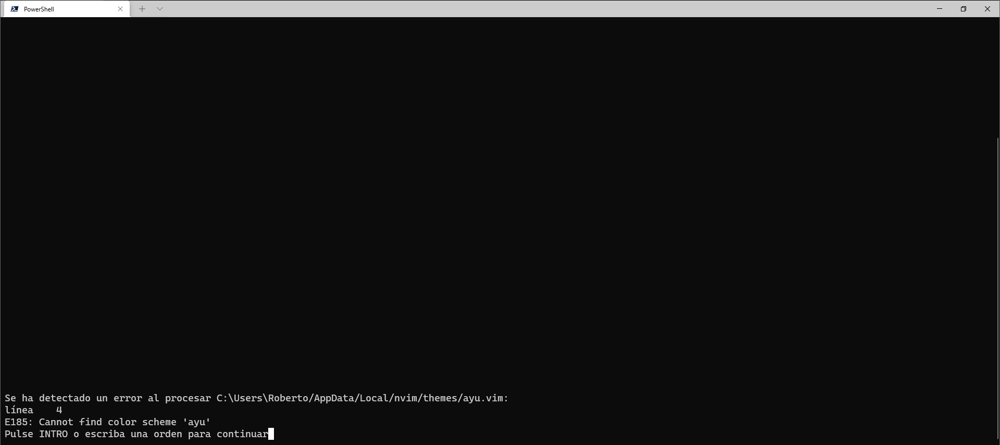

Para resolverlos, sólo le damos un **Enter** y luego vamos a ejecutar dentro de ```nvim``` el comando ```:PlugInstall``` e inmediamente se instalarán todos los Plugins que están en la lista. 

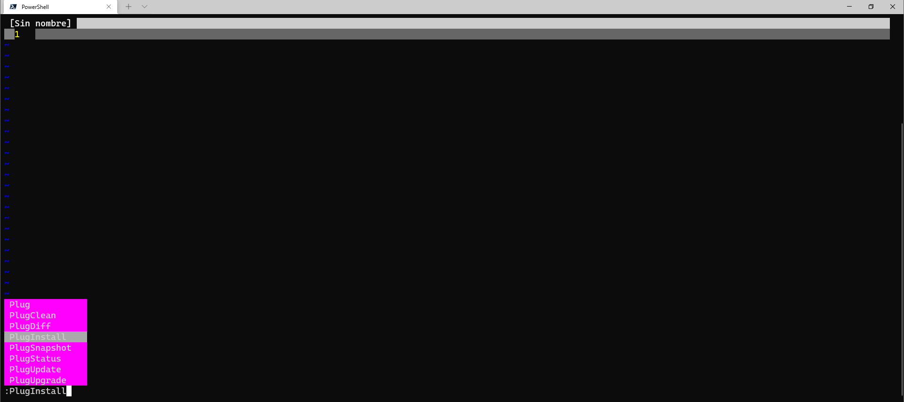

Una vez hecho esto puedes cerrar el editor con ```:q!``` y volver a abrirlo, y ya tendrías el editor de texto **Neovim** configurado en tu sistema :).

### Recomendaciones

Una vez instalado todos los plugins puedes instalar distintas extensiones utilizando [**COC**](https://github.com/neoclide/coc.nvim) (Conquer Of Completion) para autocompletado de diferentes lenguajes.

Te comparto la lista de las diferentes extensiones que están disponibles :point_right: [:link:](https://github.com/neoclide/coc.nvim/wiki/Using-coc-extensions#implemented-coc-extensions).

> Si programas para la Web te dejó el comando para que puedas instalar las extensiones más escenciales:

Dentro de neovim utiliza los ```:``` para iniciar un comando y pega lo siguiente y posteriormente un ```Enter```:
```vim
CocInstall coc-tsserver coc-json coc-emmet coc-html coc-css 
```

# Extra

## Personalizar el prompt de PowerShell

En esta sección vamos a personalizar nuestro interprete de comandos haciendo uso de [**Oh My Posh**](https://ohmyposh.dev/), un engine de Temas.

### Instalar una fuente compatible
Para que nuestro prompt se vea genial necesitaremos instalar alguna fuente que nos permita hacerlo. Así que vamos a hacer uso de las [**Nerd Fonts**](https://www.nerdfonts.com/font-downloads).

Puedes seleccionar la fuente de tu preferencia, todas nos permitirán visualizar los iconos necesarios para nuestra terminal.

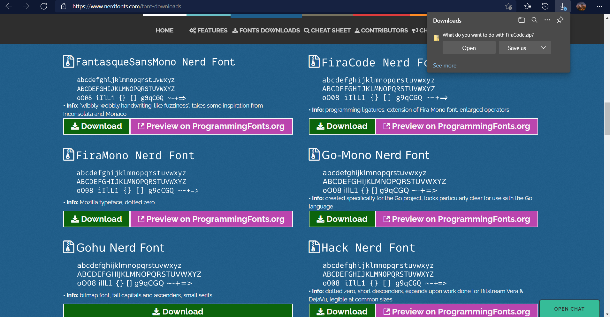

Para instalar las fuentes solamente selecciona todos los archivos e instala todas las fuentes (recomiendo la primera opción del texto en Negrita **Install** o **Instalar**).


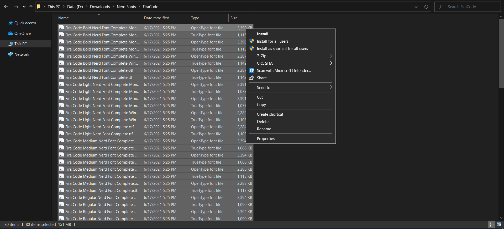

Para cambiar la fuente en la Windows Terminal sólo es de hacer lo siguiente:

Abrimos la Windows Terminal y abrimos la configuración usando los atajos de teclado ```Ctrl + ,```.

O también se puede hacer a través de la interfaz gráfica:

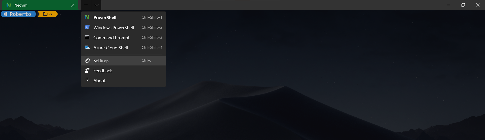

Para remover el padding o espaciado entre la terminal:

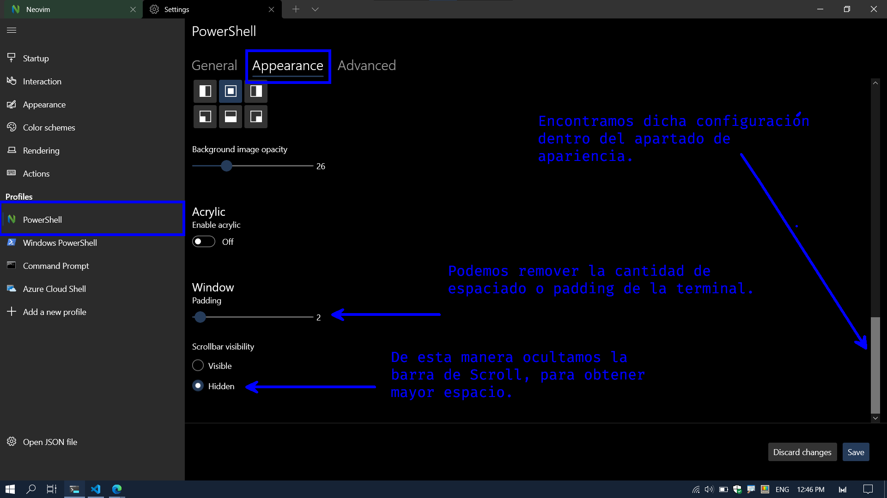

Una guía rápida de como cambiar la fuente:

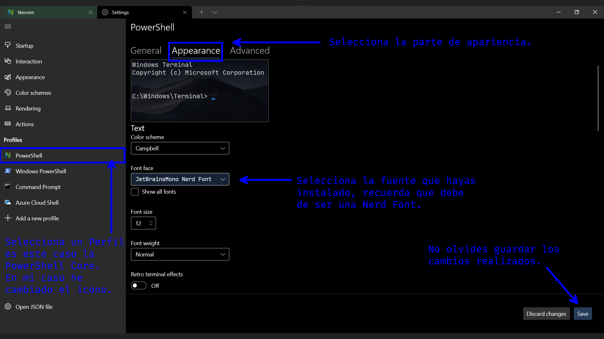


### Instalación de Oh My Posh
Para instalar **Oh My Posh** vamos a instalar un par de módulos haciendo uso de la **PowerShell Core**, el primero será:

```powershell
Install-Module oh-my-posh -Scope CurrentUser
```

Ahora para obtener ayudas o información de un repositorio de Git necesitaremos el siguiente módulo:

```powershell
Install-Module posh-git -Scope CurrentUser
```

También necesitaremos el siguiente módulo para la PowerShell Core.
 (Acerca de [PSReadLine](https://docs.microsoft.com/en-us/powershell/module/psreadline/?view=powershell-7.1&WT.mc_id=-blog-scottha&viewFallbackFrom=powershell-6))

```powershell
Install-Module -Name PSReadLine -AllowPrerelease -Scope CurrentUser -Force -SkipPublisherCheck
```
## Agregar Perfil de PowerShell Core

Finalizada la instalación de los módulos vamos a agregar las configuraciones a nuestro perfil de usuario de PowerShell Core.

Primero vamos a editar o crear el perfil, para ello solamente ejecutamos la siguiente instrucción:

> Sí has instalado Neovim puedes utilizarlo para editar el archivo o fichero ```nvim $PROFILE```, caso contrarior puedes usar el ```notepad```.

```powershell
notepad $PROFILE
```

Problamente si sea primera vez que utilizas la PowerShell Core te aparecerá una ventana emergente que te pedirá confirmar si deseas crear un Perfil de PowerShell, así que sólo da **Click en Sí**.

Ahora pega las siguientes líneas en el archivo y guarda el archivo, si lo haces en Neovim cierra el archivo para volver a la PowerShell.

```powershell
Import-Module posh-git
Import-Module oh-my-posh
Set-PoshPrompt -Theme marcduiker
```

> Para hacer que lo anterior tenga efecto sólo escribe lo siguiente o cierra la PowerShell y abré una nueva ventana:

```powershell
. $PROFILE
```

Para poder ver los temas que están disponibles utiliza la siguiente instrucción:

```powershell
Get-PoshThemes
```
Podrás tener una gran variedad de Temas para elegir, cuando ejecutes el comando tendrás una salida como la siguiente:

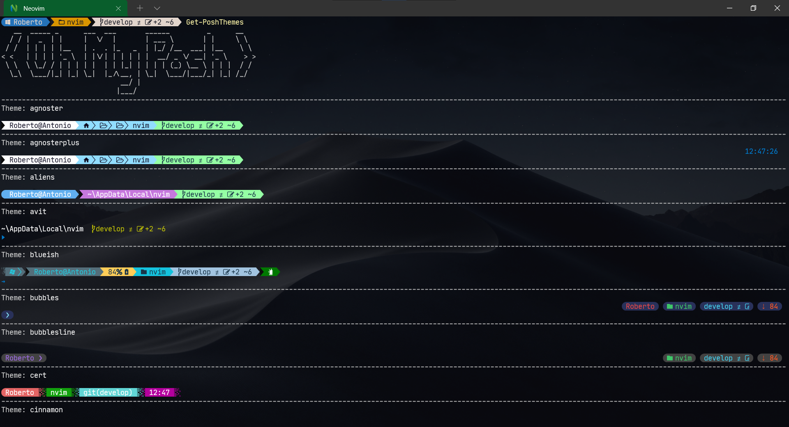

Para poder cambiar un tema sólo necesitaras **abrir el archivo del Perfil** de PowerShell, pueder ser siempre de la siguiente manera: ```notepad $PROFILE```.

Una vez abierto edita la siguiente línea y luego lo guardas:

```powershell
Set-PoshPrompt -Theme nombreDelTema
```
