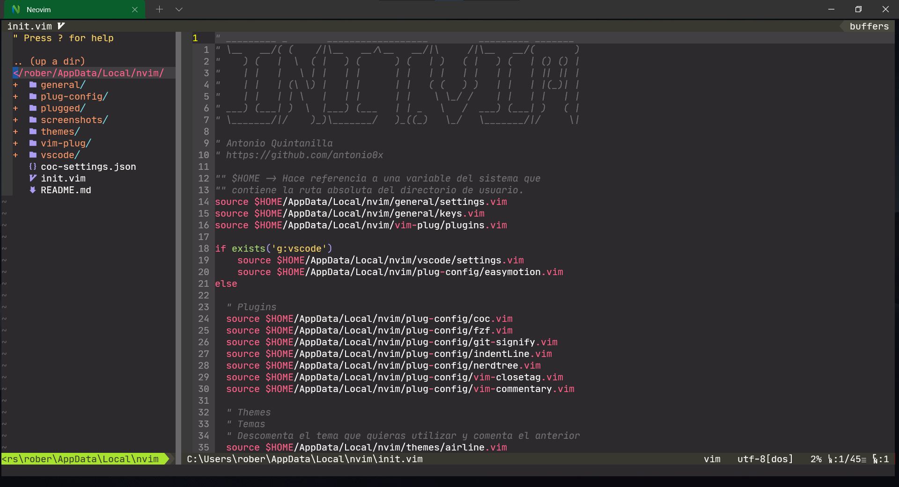
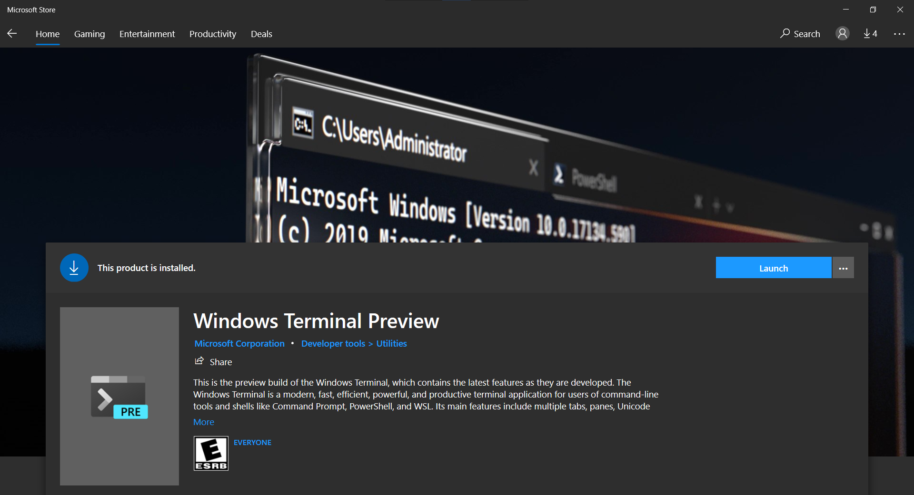

# Configuraciones Personales

## [Windows Terminal](https://www.microsoft.com/en-us/p/windows-terminal/9n0dx20hk701?activetab=pivot:overviewtab)


## [Visual Studio Code](https://code.visualstudio.com/download)


# Índice

- [Información General](#información-general)
- [Requerimientos](#requerimientos)
  - [Windows Terminal](#windows-terminal-1)
  - [PowerShell Core 7](#powershell-core-7)
  - [Chocolatey](#chocolatey)
- [Neovim](#neovim)
  - [Dependecias](#dependecias)

# Información General

Esta guía ha sido realizada con el propósito de crear una solución a la instalación y configuración un poco tediosa de Neovim en el Sistema Operativo Windows 10.
Con está guía podrás obtener una configuración decente de Neovim en Windows 10 y poder incrementar tu productividad a la hora de escribir código.

> **Disclaimer:** Mis configuraciones de Neovim están inspiradas en las de los creadores de contenido [Chris At Machine](https://youtube.com/ChrisAtMachine), [Antonio Sarosi](https://youtube.com/AntonioSarosi) y [Joaquín Varela](https://www.youtube.com/channel/UCw1Ipy5_P1OL0zUJMfYC7-A). Los invito a visitar sus redes sociales.

Perfil de GitHub de cada autor:
- :octocat: [Chris At Machine](https://github.com/ChristianChiarulli)
- :octocat: [Antonio Sarosi](https://github.com/antoniosarosi)
- :octocat: [Joaquín Varela](https://github.com/JoakoV3)


# Requerimientos
Para realizar la instalación de Neovim primero debemos contar con las siguientes herramientas o utilidades en nuestro sistema, es **importante no saltarse ningún paso**.

## Windows Terminal

Para poder utilizar Neovim y toda su potencia necesitamos un emulador de terminal más bonito que el clásico y viejo CMD o la PowerShell de Windows, así que vamos a hacer a instalar la Windows Terminal.

Para poder descargar la Windows Terminal tenemos distintas opciones, pero en este caso haremos uso de la Windows Store.
Así que solamente necesitamos acceder a la [Windows Store](https://www.microsoft.com/en-us/store/apps/windows) y en la barra de búsqueda escribimos: Windows Terminal. Seleccionamos cualquier opción, puede ser la Windows Terminal o Windows Terminal Preview.




## PowerShell Core 7

Ahora necesitamos una Shell más moderna y que se adapte a nuestras necesidades, así que vamos a instalar la [PowerShell Core](https://github.com/PowerShell/PowerShell).

Para instalarla necesitaremos visitar la página de los Releases estables: [PowerShell Core](https://github.com/PowerShell/PowerShell/releases/tag/v7.1.3) y vamos a elegir el Instalador de Microsoft para la arquitectura de x64 bits.


Una vez descargado sólo necesitaremos ejecutar el Instalador y dar los clásicos clicks de siguiente, siguiente y finalizar. Puedes marcar la casilla de Launch PowerShell antes de darle a finalizar para abrir el programa.


## Chocolatey

En este caso íremos directo a la instalación de Chocolatey pero aquí puedes encontrar la [Guía Oficial](https://chocolatey.org/install) de Instalación del gestor de paquetes para Windows llamado [Chocolatey](https://chocolatey.org/).

Para realizar la instalación de Chocolatey necesitamos abrir una ventana de la [PowerShell Core 7](https://es.wikipedia.org/wiki/PowerShell) que instalamos previamente y con permisos de **Administrador**, luego vamos a ejecutar la siguiente instrucción:

```powershell
Set-ExecutionPolicy Bypass -Scope Process
```

Posteriormente necesitamos ejecutar la siguiente instrucción o **comando** para descargar el script de instalación:

```powershell
Set-ExecutionPolicy Bypass -Scope Process -Force; [System.Net.ServicePointManager]::SecurityProtocol = [System.Net.ServicePointManager]::SecurityProtocol -bor 3072; iex ((New-Object System.Net.WebClient).DownloadString('https://chocolatey.org/install.ps1'))
```

> Una vez realizado el paso anterior y que no hayan existido errores  puedes probar a escribir ```choco o choco -?``` para verificar que el programa existe. *No cerrar la Ventana de la PowerShell para el siguiente paso*.


# [Neovim](https://neovim.io)

## Dependecias

Una vez hayamos finalizado con la instalación de **chocolatey** haremos la instalación de las depencias necesarias para Neovim. 

- RipGrep
- Git 

> *Si ya tienes **Git** instalado puedes omitir la opción borrando la palabra **git** u omite la primera instrucción y utiliza la segunda.*


```powershell
choco install ripgrep git -y
```

```powershell
choco install ripgrep -y
```

> La flag o bandera **-y** permite ejecutar la instalación sin pregutar por confirmaciones, tal cual como lo hace **apt install -y** en Debian.


Una parte importante para no tener problemas con RipGrep y obtener un filtrado del contenido de los archivos con FZF vamos a necesitar obtener la ruta de los comandos básicos en un shell de Linux y esto lo vamos a conseguir con Git **sin necesitad de utilizar WSL**.

El siguiente comando es un pequeño one-liner que he hecho para agregar la ruta de los binarios básicos de un sistema Linux tradicional, para que funcioné se **necesitarán permisos de administrador**, así que deberás abrir administrador una ventana de Powershell Core y pegar los siguientes comandos.


Primero para las variables de Sistema:

```powershell
$GIT_USR_PATH = (cmd /c where git); $GIT_USR_PATH -replace "\\cmd\\git.exe", "\usr\bin" | `
  Tee-Object -Variable GIT_USR_PATH; [Environment]::SetEnvironmentVariable("Path", $env:Path + ";$GIT_USR_PATH", "Machine")
```

Ahora para las variables de Usuario:
```powershell
$GIT_USR_PATH = (cmd /c where git); $GIT_USR_PATH -replace "\\cmd\\git.exe", "\usr\bin" | `
  Tee-Object -Variable GIT_USR_PATH; [Environment]::SetEnvironmentVariable("Path", $env:Path + ";$GIT_USR_PATH", "User")
```

**Importante en caso de errores:** te podría indicar el siguiente error: *Could not find files for the given pattern(s)* si no tenías Git instalado y no tienes agregada la ruta de Git en el PATH necesitarás lo siguiente. Funcionará si has hecho la instalación por defecto, para ello pega el siguiente comando en la PowerShell Core para agregarlo de forma temporal en el PATH: 

```powershell
$env:Path += ";C:\Program Files\Git"
```

Finalmente haremos la instalación de neovim, para ello vamos a utilizar **permisos de administrador** en una PowerShell Core y pegar la siguiente instrucción de instalación con chocolatey:

```powershell
choco install neovim -y --pre
```

> La flag *--pre* le índica a chocolatey que vamos a instalar una versión de un programa en su fase beta, es decir, un pre-release de una aplicación, en este caso [**Neovim**](https://neovim.io) en su versión 0.5.0.

Una vez instalado vamos a necesitar un manejador de Plugins para nuestro editor, en nuestro caso será [vim-plug](https://github.com/junegunn/vim-plug).

Puedes revisar la Guía de Instalación en el README del repositorio oficial de vim-plug, para acelerar el proceso dejo el comando que se necesita para PowerShell el cual solamente necesitarás pegar.

```powershell
iwr -useb https://raw.githubusercontent.com/junegunn/vim-plug/master/plug.vim |`
    ni "$(@($env:XDG_DATA_HOME, $env:LOCALAPPDATA)[$null -eq $env:XDG_DATA_HOME])/nvim-data/site/autoload/plug.vim" -Force
```

Una vez completada la instalación de nuestro manegador de Plugins vamos a clonar este repositorio; para que todo funcione necesitarás clonarlo de la siguiente manera:

```powershell
git clone https://github.com/antonio0x/neowindows.git $HOME\AppData\Local\nvim
```

> Esto es un ahorro a tener que buscar el directorio **AppData\\Local** y luego abrir una PowerShell o CMD dentro del directorio y tener que clonarlo desde allí.

Llegados hasta este punto vamos a ejecutar ahora sí neovim, para ello escribimos ```nvim``` en la PowerShell y de primera mano tendremos varias advertencias de que existen cosas que no existen o no se han encontrado.

Para resolverlos solamente necesitaremos ejecutar dentro de ```nvim``` el comando ```:PlugInstall``` e inmediamente se instalarán todos los Plugins que tengo en mi lista. 

Una vez terminada la instalación solamente necesitarás recargar neovim, para ello sólo necesitarás salir con ```:q``` o ```:q!``` y luego volver a entrar a **nvim**, y si todo funcionó, ya estás listo para utilizar mis configuraciones en tu sistema.